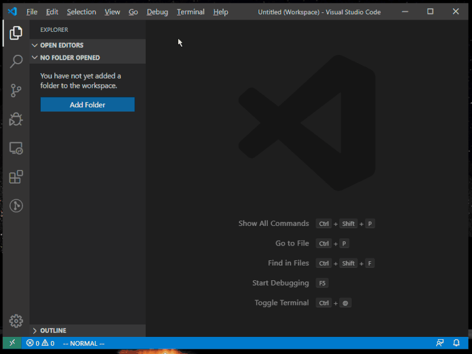

# Dynamic Template Expander

This extension allows you to create new file/folder based on template,
using dynamic pathname and content.

## Features

- Template is fully configurable and allows both pathname and content to be generated on-the-fly.
  - This is nice when you want to include date/time.
- In addition to predefined template variables for dynamic expansion, you can also use any JavaScript API (including VSCode API) for dynamic processing.
  - Even remote template is possible if you fetch it over the net.
- Hook handler can be defined and run when template is generated.
  - It's handy to have file opened or folder added to workspace.
- You can define both relatively-pathed and absolutely-pathed template.
  - Absolute-path template saves you a trouble from creating it at wrong place.
  - Relative-path template gives you a flexibility by either letting you to select/edit target folder to expand, or use the folder in File Explorer when invoked from context menu.
- Any number of template configuration files can be registered.
  - You can manage workspace-specific template and your personal template separately.

## Requirements

There is no requirement - just install this extension and off you go.

## Extension Settings

This extension contributes the following settings:

* `dynamicTemplate.configFiles`: Add any external configuration in addition to default configurations loaded from workspace and home directory.

By default, configuration(s) are loaded from following locations:

* \<workspace-root\>/.vscode/extensions/tai.dynamic-template/template.js
* \<home\>/.vscode/extensions/tai.dynamic-template/template.js

For multi-root workspace, each workspace rootdir is scanned for above file.

## Known Issues

* Error reporting is still weak and does not show when it failed to create template.

## TODOs

* Need more document on template configuration
* Add non-overwrite mode
* Add support for template fetching over network

## Release Notes

### 0.1.1

Updated document.
